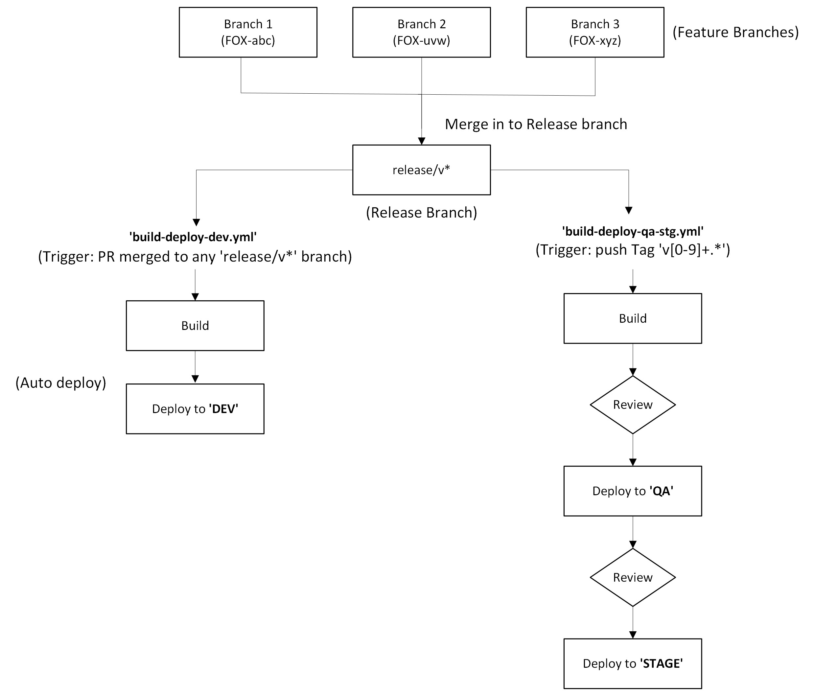

# acumatica-uss-fence-customizations
This repository contains the **AcumaticaUSSFenceCustomizations [2024R1]** package. Acumatica customizations that incorporate .NET code, with complete CI/CD automation using GitHub Actions for building, packaging, and deploying to Dev, QA and Stage environments.

***
## Project Structure
```
├── AcumaticaUSSFenceCustomizations[2024R1]     # Main Acumatica customization project
├── Customizations                              # Includes Pages, Bin, and _project used in the ZIP package
├── buildCustomization.ps1                      # Script to package customization ZIP
├── publishCustomization.ps1                    # Script to publish package to Acumatica Instance
└── .github/workflows                           # GitHub Actions CI/CD workflows
```

***
## Branching Strategy and CI/CD Process

1. For each Sprint, create a new release branch with the naming convention `release/v1.<yy>.<sprint#>`
2. For Feature Development, create a Feature branch with the User Story Name `FOX-###-<User Story Desc>`. This would ensure that the branch gets linked to the correct US in JIRA
3. Once the user story is tested, create a PR to merge the US branch to release branch `release/v1.<yy>.<sprint#>`. Ensure that the commit mentions the US Number so that future promotions can be linked to the US in JIRA
4. **To deploy to the Dev environment**, merge the PR into a `release/v*` branch—this automatically triggers the Dev deployment workflow.
5. **To deploy to QA and Stage**, create and push a Git **tag** (e.g., `v1.24.3.0`) on the `release` or `main` branch. This triggers the QA/Stage deployment workflow.
5. DevOps will use the promotion workflow to deploy the packages to QA, STG and PROD Envs. The promotion workflow will be triggered by creating a tag on the `main` branch

    ## Tag Naming Convention

    ### Regular Releases

    - tag naming to follow the sprint naming convention `v1.<yy>.<sprint#>.<build#>` for regular builds. The build number will have to be incremented manually when tagging

    ### Hotfix
    
    -  tag naming to follow the sprint naming convention `v1.<yy>.<sprint#>.<build#>-hotfix`. The build numver will be incremented from the previous release build

***
## CI/CD Workflow Diagram

The diagram below illustrates the CI/CD process for Dev, QA and Stage environments:


***
## Note on Dependent DLLs

This repository depend on shared DLLs which stored in the [`acumatica-packages`](https://github.com/USSBI/acumatica-packages) repository. These include common dependencies across projects like **NAWUnitedSiteServices** and **Rental360**.

### Important:  
> If any changes are made to shared components or DLLs, make sure the updated DLLs are pushed to the `acumatica-packages` repository **before running the CI/CD workflow**.  
> This ensures the pipeline doesn't fail due to missing or outdated dependencies.

***
# Development Setup  

This section provides instructions on setting up environment variables, building, and deploying the project.

## Environment Setup

To set up the environment for building and deploying the `acumatica-uss-fence-customizations` project, you need to create a `.env` file in the root directory of your project with the following variables:

```env
# Acumatica credentials
AC_USERNAME=your_acumatica_username
AC_PASSWORD=your_acumatica_password
AC_TENANT=your_acumatica_tenant
AC_BRANCH=your_acumatica_branch
AC_BASE_URL=your_acumatica_base_url

# Project details
PROJECT_NAME=AcumaticaUSSFenceCustomizations[2024R1]
PROJECT_DESCRIPTION="USS Acumatica Fence Customization"
PROJECT_LEVEL=300